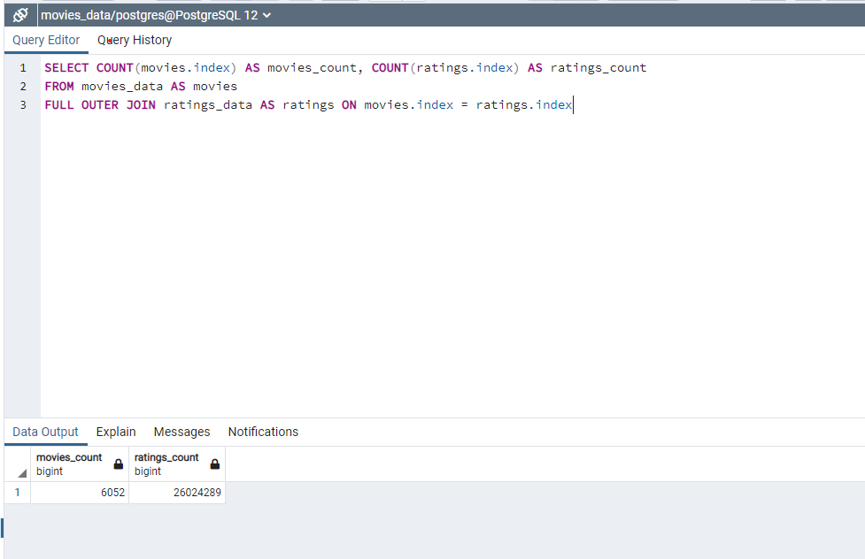

# movies_ETL_UT_DATA

## Resources

- Data Source:
  - [Movie Data (csv)](./resources/movies_metadata.csv)
  - [Wiki Movies (json)](./resources/wikipedia_movies.json)
  - Non committed large csv `ratings.csv`

- Software:
  - Python 3.7
  - Jupyter Notebook
  - PostgreSQL 12
  - pgAdmin 4
  

## Purpose Overview

Amazing Prime loves the dataset and wants to keep it updated on a daily basis. Britta needs your help to create an automated pipeline that takes in new data, performs the appropriate transformations, and loads the data into existing tables. You’ll need to refactor the code from this module to create one function that takes in the three files—Wikipedia data, Kaggle metadata, and the MovieLens rating data—and performs the ETL process by adding the data to a PostgreSQL database.

`ETL_create_database.ipynb`

### Deliverable 1

Using your knowledge of Python, Pandas, the ETL process, and code refactoring, write a function that reads in the three data files and creates three separate DataFrames.

`ETL_function_test.ipynb`

### Deliverable 2

Using your knowledge of Python, Pandas, the ETL process, and code refactoring, extract and transform the Wikipedia data so you can merge it with the Kaggle metadata. While extracting the IMDb IDs using a regular expression string and dropping duplicates, use a try-except block to catch errors.

`ETL_clean_wiki_movies.ipynb`

### Deliverable 3

Using your knowledge of Python, Pandas, the ETL process, and code refactoring, extract and transform the Kaggle metadata and MovieLens rating data, then convert the transformed data into separate DataFrames. Then, you’ll merge the Kaggle metadata DataFrame with the Wikipedia movies DataFrame to create the movies_df DataFrame. Finally, you’ll merge the MovieLens rating data DataFrame with the movies_df DataFrame to create the movies_with_ratings_df.

`ETL_clean_kaggle_data.ipynb`

### Deliverable 4

Use your knowledge of Python, Pandas, the ETL process, code refactoring, and PostgreSQL to add the movies_df DataFrame and MovieLens rating CSV data to a SQL database.

`ETL_create_database.ipynb`

## Outcome

- [Query (png)](./resources/movies_query.png)
